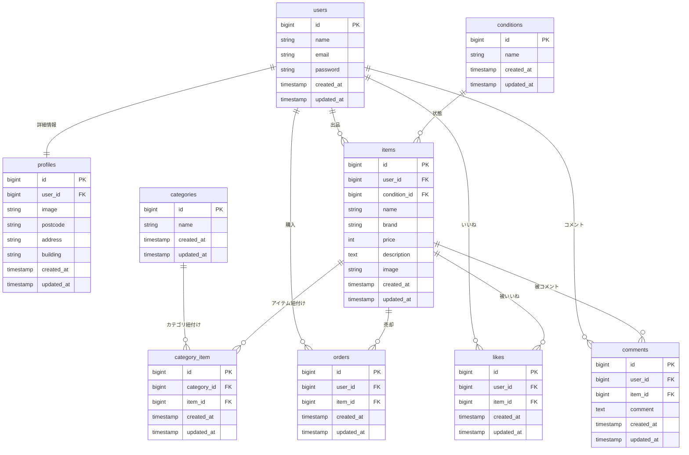

```mermaid
erDiagram
    users ||--|| profiles : "詳細情報"
    users ||--o{ items : "出品"
    users ||--o{ orders : "購入"
    users ||--o{ likes : "いいね"
    users ||--o{ comments : "コメント"

    categories ||--o{ category_item : "カテゴリ紐付け"
    items ||--o{ category_item : "アイテム紐付け"
    
    conditions ||--o{ items : "状態"
    items ||--o{ orders : "売却"
    items ||--o{ likes : "被いいね"
    items ||--o{ comments : "被コメント"

    profiles {
        bigint id PK
        bigint user_id FK
        string image
        string postcode
        string address
        string building
        timestamp created_at
        timestamp updated_at
    }

    items {
        bigint id PK
        bigint user_id FK
        bigint condition_id FK
        string name
        string brand
        int price
        text description
        string image
        timestamp created_at
        timestamp updated_at
    }

    category_item {
        bigint id PK
        bigint category_id FK
        bigint item_id FK
        timestamp created_at
        timestamp updated_at
    }

    conditions {
        bigint id PK
        string name
        timestamp created_at
        timestamp updated_at
    }

    users {
        bigint id PK
        string name
        string email
        string password
        timestamp created_at
        timestamp updated_at
    }

    categories {
        bigint id PK
        string name
        timestamp created_at
        timestamp updated_at
    }

    orders {
        bigint id PK
        bigint user_id FK
        bigint item_id FK
        timestamp created_at
        timestamp updated_at
    }

    likes {
        bigint id PK
        bigint user_id FK
        bigint item_id FK
        timestamp created_at
        timestamp updated_at
    }

    comments {
        bigint id PK
        bigint user_id FK
        bigint item_id FK
        text comment
        timestamp created_at
        timestamp updated_at
    }
```