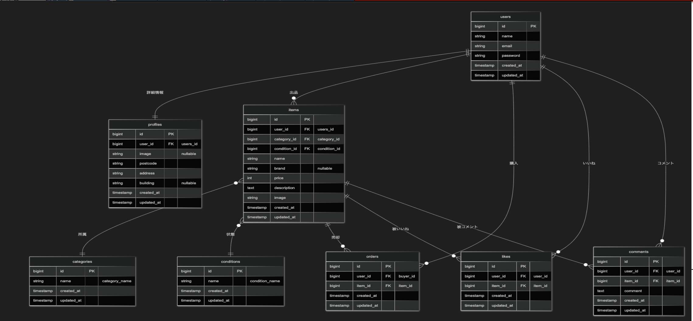

# アプリケーション名
フリマアプリ（COACHTECH）

## 環境構築
Docker（Laravel Sail）を使用した環境構築手順です。
```bash
# 1. リポジトリのクローンとディレクトリへの移動
git clone [https://github.com/hana20210115/coachtech-frima.git](https://github.com/hana20210115/coachtech-frima.git)
cd coachtech-frima

# 2. Composerパッケージのインストール
docker run --rm \
    -u "$(id -u):$(id -g)" \
    -v "$(pwd):/var/www/html" \
    -w /var/www/html \
    laravelsail/php82-composer:latest \
    composer install --ignore-platform-reqs

# 3. 環境変数の設定
cp .env.example .env
# ※ここで .env ファイルを開き、DB_HOST=mysql に変更し、StripeのAPIキー等を設定してください。

# 4. Dockerコンテナのビルドと起動
./vendor/bin/sail up -d --build

# 5. アプリケーションキーの生成
./vendor/bin/sail artisan key:generate

# 6. 画像保存用のストレージリンク作成
./vendor/bin/sail artisan storage:link

# 7. データベースのマイグレーションとシーディング
./vendor/bin/sail artisan migrate:fresh --seed
```

## 使用技術(実行環境)
- PHP 8.x
- Laravel 10.x
- MySQL 8.x
- Laravel Sail (Docker)
- Stripe (決済システム)
- Tailwind CSS

## ER図


## URL
- 開発環境：http://localhost/
- ユーザー登録：http://localhost/register
- ログイン：http://localhost/login